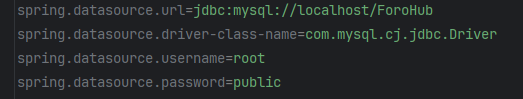
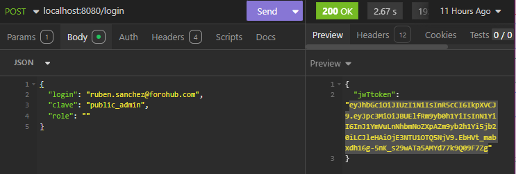
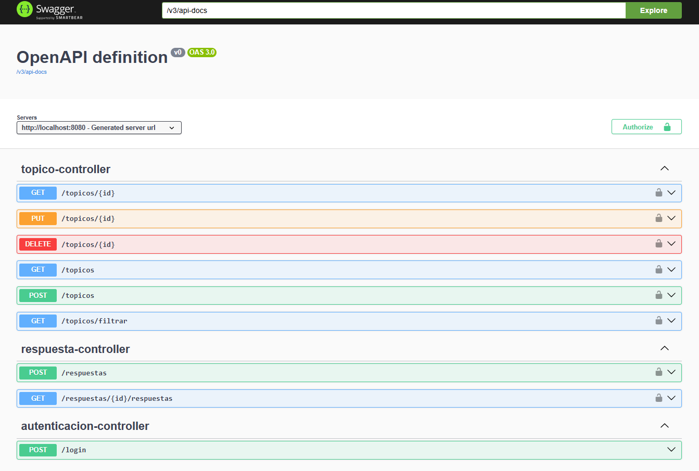

 

  

![Alura]
  <h1>Challenge: API REST ForoHub 💻🐱‍👤</h1>
  

    💻🔀🌐ForoHub es una API REST es un proyecto que brindara el apoyo en operaciones CRUD, para una 
    plataforma de discusiones (Foro), construida para el challenge de Alura Latam G8 ✅

  

---

Indice

- [🤔Acerca del proyecto](#acerca-del-proyecto)
- [👷‍♂️Construido con:](#️construido-con)
- [🛠Cómo empezar.](#cómo-empezar)
  - [📜Requisitos](#requisitos)
  - [🐾 Pasos](#-pasos)
- [🛶Funcionamiento](#funcionamiento)
  - [🔐 Autenticación y Seguridad con JWT](#-autenticación-y-seguridad-con-jwt)
    - [🔄 Flujo de Autenticación](#-flujo-de-autenticación)
  - [🔍✅❌ Validaciones automáticas](#-validaciones-automáticas)
  - [📚📚 Documentación Interactiva con Swagger UI](#-documentación-interactiva-con-swagger-ui)
  - [📲 Endpoints disponibles](#-endpoints-disponibles)
  - [🚓Excepciones y contramedidas](#excepciones-y-contramedidas)
- [Roadmap](#roadmap)

---

## 🤔Acerca del proyecto

Foro Hub es una API REST que forma parte del backend de un Foro `es un lugar donde todos los participantes de una plataforma
pueden colocar sus preguntas sobre determinados asuntos.`
Este proyecto fue desarrollado como parte del Challenge de **Alura Latam** - **Oracle Next Education**.

La API incluye funcionalidades para la gestión de usuarios, roles, módulos, cursos, tópicos y 
respuestas, con autenticación basada en JWT y control de acceso basado en roles.

Nuestra API va a centrarse específicamente en los tópicos, y debe permitir a los usuarios:

* Crear un nuevo tópico
* Mostrar todos los tópicos creados
* Mostrar un tópico específico
* Actualizar un tópico
* Eliminar un tópico 
* Creacioin y autenticacion de usuarios
* Respuestas en los topicos

Es lo que conocemos comúnmente como CRUD (CREATE, READ, UPDATE, DELETE) y es muy parecido con lo que desarrollamos en el Hotel Alura, pero ahora usando un framework que va a facilitar mucho nuestro trabajo.

Al final de nuestro desarrollo tendremos una API REST con las siguientes funcionalidades

1. API con rutas implementadas siguiendo las mejores prácticas del modelo REST;
2. Validaciones realizadas según reglas de negocio;
3. Implementación de una base de datos para la persistencia de la información;
4. Servicio de autenticación/autorización para restringir el acceso a la información.

Este proyecto hará uso de:

- JWT para la crecion y autenticacion de tokens para los usuarios
- Swagger para la documentacion del api y pruebas 
- Spring security para el acceso autorizado en los enlaces del api

---

## 👷‍♂️Construido con:

Su construcción fue mediante las siguientes herramientas:

![Java]
![IntelliJ IDEA]
![Git]
![GitHub]
![Spring Boot]
![MySQL]
![Swagger]
![JWT]

## 🛠Cómo empezar.

### 📜Requisitos

- Tener instalado Java JDK 17.0.6.
- Un IDE que ejecute Java (IntelliJIDEA, NeatBeans).
- Tener instalado MySQL 
- SpringBoot
- Instalado Insomnia (para las pruebas-no tan necesario)

### 🐾 Pasos

1. Descargar o clonar este repositorio.

   `https://github.com/RubenD-hub/Challenge-Conversor-de-Moneda.git`

2. Abrir el repositorio con el IDE preferido.
3. Compilar y ejecutar el proyecto.

## 🛶Funcionamiento

Antes de ejecutar el programa se necesitará tener las credenciales para la conexion a la base de datos.

Al momento de ejecutar la aplicacion se generarán la creacion de las tablas en la Base de Datos de MySQL.
Siguiendo el siguiente esquema.

### 🔐 Autenticación y Seguridad con JWT

El sistema implementa un flujo completo de autenticación basado en JSON Web Tokens (JWT), garantizando el acceso controlado a los recursos del backend:

#### 🔄 Flujo de Autenticación

1. **Login de usuario** (`POST /login`): El usuario envía credenciales válidas (email y contraseña).
2. **Generación de Token JWT**: Si las credenciales son correctas, se devuelve un token de autorizacion.
3. **Acceso a recursos protegidos**: El token debe incluirse en cada solicitud como header `Authorization: Bearer <token>`.

### 🔍✅❌ Validaciones automáticas

- Tokens expirados o malformados generan error `401 Unauthorized`.
- Acceso sin permisos suficientes responde con `403 Forbidden`.
- Tokens válidos permiten acceso a operaciones como crear, listar y responder tópicos.

### 📚📚 Documentación Interactiva con Swagger UI
Se incluyó Swagger/OpenAPI v3 para generar documentación técnica y habilitar pruebas interactivas desde 
navegador:

1. Acceso: /swagger-ui/index.html
2. Puedes logearte desde Swagger
3. Obtener el token de autorizacion
4. Permite probar las otras request
5. Muestra los resultados de la request solicitada

### 📲 Endpoints disponibles
* - /login		Autenticacion de usuario y obtencion de token
* - /topicos	topicos con funcionalidades CRUD
* - /respuestas respuestas con funcionalidades CRUD

    
### 🚓Excepciones y contramedidas
Se tiene la validacion de datos de entrada de las request, asi como la validacion de los errores que se pueden presentar.

## Roadmap
Pero aún se puede tener mejoras futuras:

- [ ] Mejora en la relacion de las entidades
- [ ] Agregar mas validaciones
- [ ] Agregar la conexion con un frontend

<a href="#readme-top">regresar al inicio</a>

[Java]:https://img.shields.io/badge/Java-%23ED8B00.svg?logo=openjdk&logoColor=white

[IntelliJ IDEA]:https://img.shields.io/badge/IntelliJIDEA-000000.svg?logo=intellij-idea&logoColor=white

[Git]:https://img.shields.io/badge/Git-F05032?logo=git&logoColor=fff

[GitHub]:https://img.shields.io/badge/GitHub-%23121011.svg?logo=github&logoColor=white

[Alura]:https://custom-icon-badges.demolab.com/badge/Alura-001332?logo=alura-white&logoColor=fff

[Spring Boot]:https://img.shields.io/badge/Spring%20Boot-3.5.3-green

[MySQL]:https://img.shields.io/badge/MySQL-8.0-blue

[Swagger]:https://img.shields.io/badge/Swagger-Documented-brightgreen

[JWT]:https://img.shields.io/badge/JWT-Auth-red